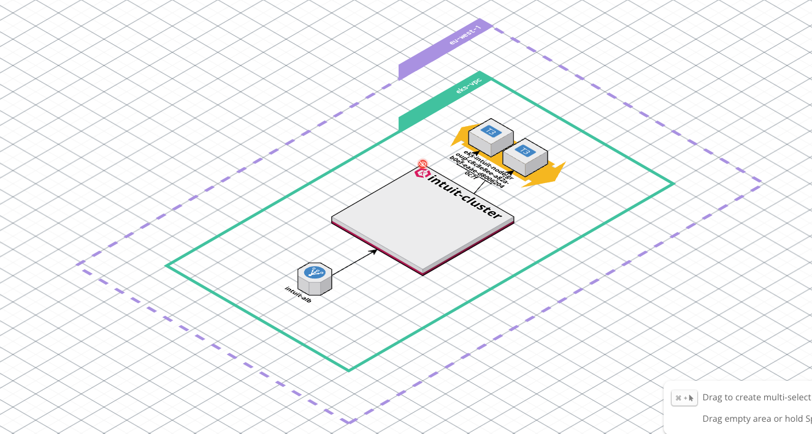
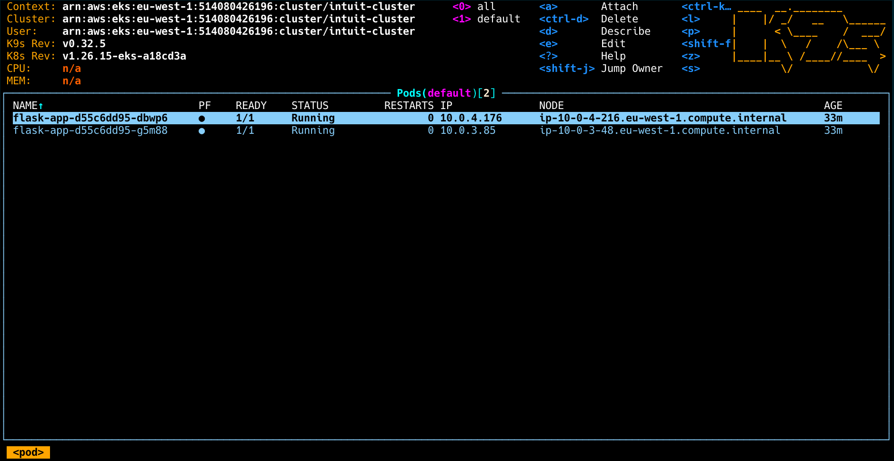
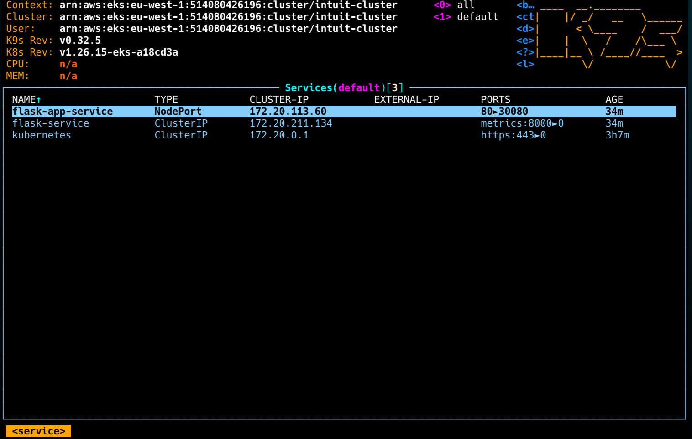
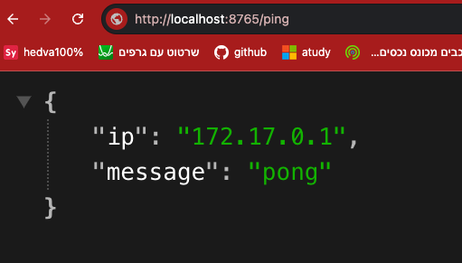
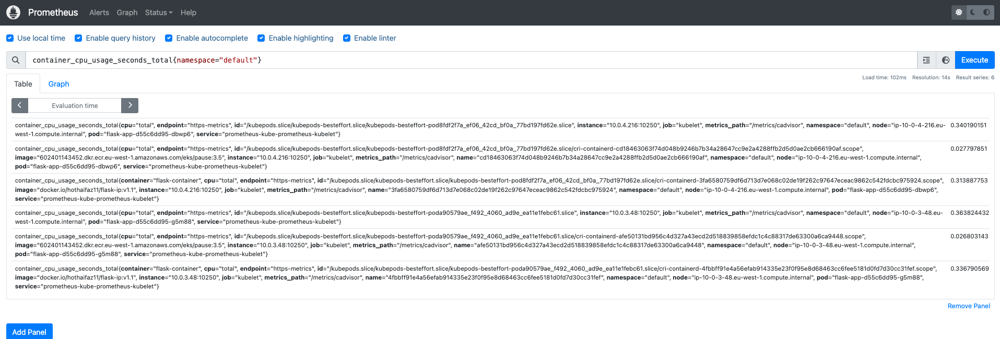
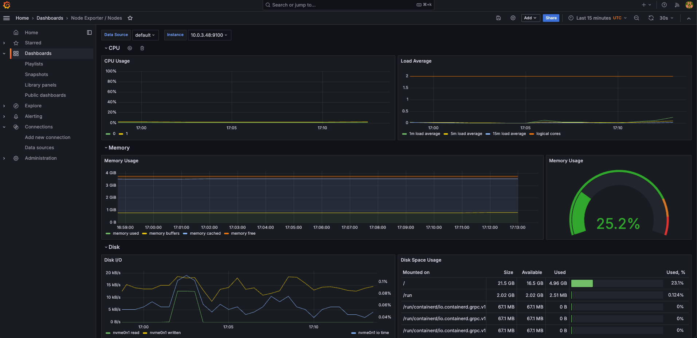
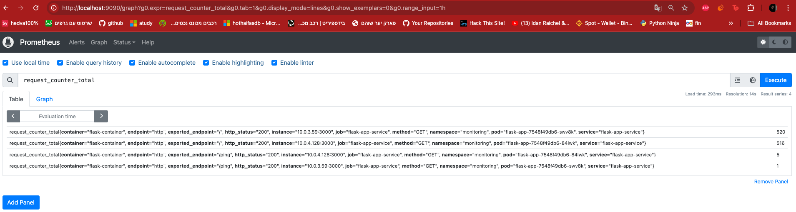
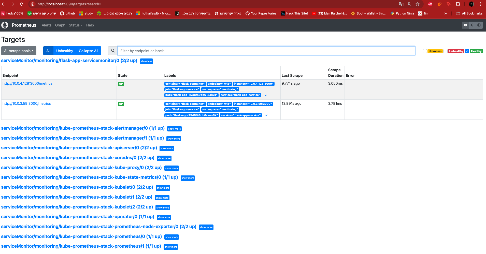

# EKS Cluster with Observability and Monitoring

This repository contains Terraform configuration files for setting up an Amazon EKS cluster along with networking, AWS Load Balancer Controller, and observability tools such as Prometheus, Grafana, and OpenTelemetry.

## Table of Contents

1. [Prerequisites](#prerequisites)
2. [Setup Instructions](#setup-instructions)
3. [Terraform Configuration](#terraform-configuration)
4. [Application Deployment](#application-deployment)
5. [Install And Deploy Observability Tools](#install-and-deploy-observability-tools)
   - [5.1. Deploy Prometheus & Grafana](#deploy-prometheus-and-grafana)
   <!-- - [5.2. Deploy ELK stack ](#deploy-elk-stack)
   - [5.3. Deploy OpenTelemetry Collector](#deploy-opentelemetry-collector) -->

## Prerequisites

- **AWS Account**: You need an AWS account to create and manage resources.
- **Terraform**: Install Terraform
- **kubectl**: Install `kubectl`
- **AWS CLI**: Install AWS CLI and configure it with your AWS credentials.
- **Python CLI**: Install Python 3.X .

## Setup Instructions

## terraform configuration

inside the terraform folder we do have terraform configuration file to create EKS cluster

```bash
    terraform init
    terraform validate
    terraform plan
    terroform apply -y
```



## Application Deployment

in the kubernetes file we can find the kubernetes yaml files to create a deployment,service,servicemonitor

```bash
    for file in *.yaml; do kubectl apply -f $file; done
```




to access the application for testing without ingress use this command

```bash
    kubectl port-forward svc/flask-app-service 8765:80
```

and you can access the application using this URL http://localhost:8765/ping


## Install And Deploy Observability Tools

using helm charts I configured and deployed the serverices such as (prometheus server serviceMonitor and grafana ...)

### Deploy Prometheus and Grafana

```bash
    helm repo add prometheus-community https://prometheus-community.github.io/helm-charts
    helm repo update
    helm install prometheus prometheus-community/kube-prometheus-stack -n monitoring
```

this helm repo will deploy grafana and prometheus
to access GRAFANA locally we can run the port-forward command

```bash
    kubectl port-forward -n namespace svc/servicename port:port
```

prometheus service name => prometheus-kube-prometheus-prometheus
grafana service name => prometheus-grafana

dont forgate to specify the namespace in the commands





targets

